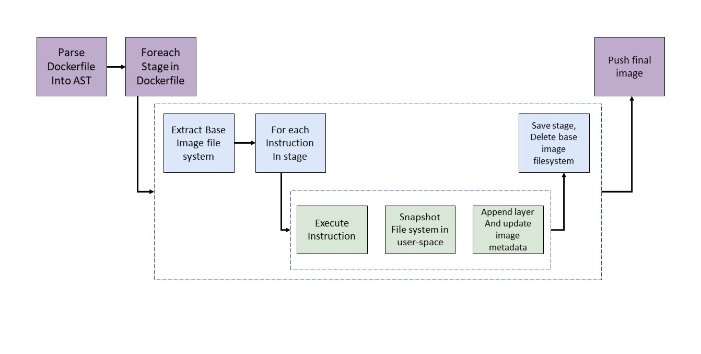
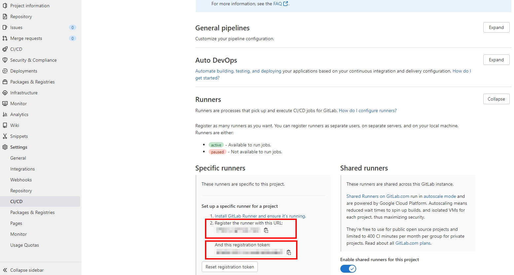
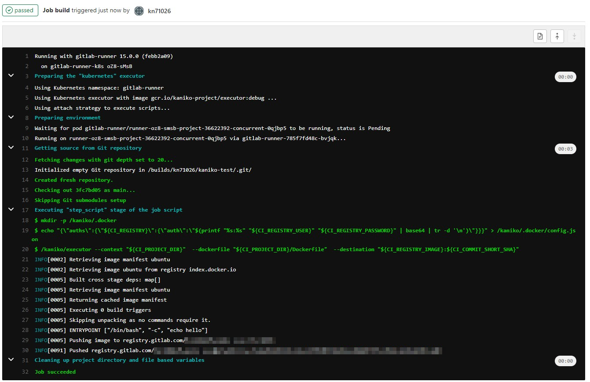

# Kaniko 教學
Kaniko 是 Google 在 2018 年釋出的開源容器映像檔工具，最大的特點就是不需依賴於 Docker Daemon，所有操作都是在 user-space 執行。

## 前言
通常在 CI/CD 中 build image 有下列幾種方式：
### Use Docker-in-Docker
在容器中執行 `docker` 指令，會在 privileged mode 下執行 build image 相關操作。
但必須在 privileged mode 底下執行，以及無法使用 layer caching 這類的快取機制，官方也較不推薦。

### Use Docker socket binding 
又被稱為 DooD (Docker-outside-of-Docker)，掛載 Host 端的 docker socket 到 container，讓 container 不需 Docker daemon 也能運行相關操作。
但在掛載 `/var/run/docker.sock` 後，相當於環境沒有被完全隔離，可能與其他容器衝突。


### Use other tool without privileged mode
使用如本篇介紹的 Kaniko 或是 Buildah，主要是為了解決 Dind 的問題：
- Docker-in-Docker 需要特權模式才能運行
- Docker-in-Docker 通常會導致性能損失並且速度可能非常慢

## 運作原理
- 以下操作皆在 user-space 使用 executor image 執行，避免使用privileged mode，因此也不會需要 docker daemon。
  - Kaniko 會從 Base image 提取 file system
  - 當逐行執行 Dockerfile 時，在 user-space 對 filesystem 做快照，運用 cache 去和 base image 比對
  - 將有更改的 files append 到 base image，並更新 image 的 metadata
  - 當最後執行完整個 Dockerfile 時， Kaniko executor 將 build 完成的 image push 到指定的 registry 中。

- 流程如下圖：
- 根據顏色分為不同層級
    * 紫色的是最外層的邏輯
    * 藍色的是每個 stage
    * 綠色的是執行 Dockerfile 裡面的 instruction




- 實際執行時，實際上會由 builder executable 去負責圖中所有的工作，這個執行檔會存在由 Kaniko 建立的 /workspace 底下，並先 extract base image 的 filesystem  到 root，在執行後續操作


### 不需要 privileged mode 的原因
- Kaniko 在所有操作中沒有引入任何 Docker daemon 或者 CLI 操作。
  - 解壓文件系統（filesystem）
  - 執行命令
  - 在執行器鏡像（executor image）的用戶空間中對文件系統做快照（snapshot）

### 優點
- 不需相依於 Docker daemon
- 都在 Linux userspace 執行
- 採用非特權權限的容器


### 缺點
- 在 Kaniko container 裡面 build time 要用 root 執行
- 較傳統用 docker build 的方式複雜
- 沒有支援 local 的 layer caching


## 使用情境
- 官方文件中，推薦了四種運行 Kaniko 的方法：
    - Kubernetes cluster
    - In gVisor
    - In Google Cloud Build
    - In Docker
- 適合在無法獲取 docker daemon 的環境下 build image：如 Kubernetes cluster、Google Kubernetes Engine
- 適合用在 Gitlab CI 過程中去 build image


## 事前準備
1. Dockerfile
2. Build Contexts：包含 Dockerfile 的 Source Code 目錄
    * GCS Bucket
    * S3 Bucket
    * Azure Blob Storage
    * Local Directory
    * Local Tarball
    * Standard Input
    * Git Repository
3. Registry：用來存放 image 的 Registry，支援 OCI 標準的 Registry 皆可
    * Docker Hub
    * Harbor
    * Google GCR
    * Amazon ECR
    * Azure Container Registry
    * JFrog Container Registry

## Lab
1. 使用 minukube 在本機上運行
2. 搭配 Gitlab CI
    - https://docs.gitlab.com/ee/ci/docker/using_kaniko.html


### Lab 1.
1. 準備執行所需環境：Kubernetes Cluster 以及 Docker Hub 帳號 
2. 準備使用 kaniko 所需的 config files
3. 準備要用來掛載的本地目錄
4. 建立 secret 用來儲存 registry 所需的 authorization token
5. 在 Kubernetes cluster 中建立相關資源並完成 build and push image
6. pull image 下來測試是否能運行


#### 準備執行所需環境
- 安裝 [minikube](https://minikube.sigs.k8s.io/docs/start/) 或是使用 kops 建立 cluster
    - 根據自身作業系統選擇相對應的版本安裝
- 建立 cluster
    ```shell=
    minikube start
    ```
- 建立 [Docker Hub](https://hub.docker.com/) 帳號

#### 準備使用 kaniko 所需的 config files
這邊需要準備三個檔案
- pod.yaml：建立執行 kaniko 的 pod
    - `--context`： 可指定 Git Repository 作為 build context，若未特別指定則預設使用 local directory，用法如下：
    - `--context=git://[repository url][#reference][#commit-id]`
    - `--destination`： 指定 Registry 以及 Repo 名稱，可在此處上 image tag，這邊我們使用 docker hub 作為目標 Registry，因此需更改為使用者 docker hub的 username
- volume.yaml：建立存放 build context 的 persistent volume 
- volume-claim.yaml：建立 persistent volume claim，後續會用來掛載 kaniko container
#### 準備要用來掛載的本地目錄
需要在 cluster 內建立作為 build context 掛載的目錄，並建立 dockerfile

這邊以運行 minikube 為例，可透過 `minikube ssh` 進到 cluster 內
```shell=
$ mkdir kaniko && cd kaniko
$ echo 'FROM ubuntu' >> dockerfile
$ echo 'ENTRYPOINT ["/bin/bash", "-c", "echo hello"]' >> dockerfile
$ cat dockerfile
FROM ubuntu
ENTRYPOINT ["/bin/bash", "-c", "echo hello"]
$ pwd
/home/<user-name>/kaniko # 將此路徑填入 volume.yaml file
```


#### 建立 secret 用來儲存 Registry 所需的 authorization token
在 build 完 image 後，通常需要將 image 上傳到 image Registry，這邊使用 secret 存放相關帳號認證資訊
```shell=
kubectl create secret docker-registry regcred --docker-server=<your-registry-server> --docker-username=<your-name> --docker-password=<your-pword> --docker-email=<your-email>
```
* your-registry-server： 填入 Registry 的 FQDN. (`https://index.docker.io/v1/` for DockerHub)
* your-name：  Dockerhub username.
* your-pword： Dockerhub password.
* your-email： Dockerhub email.

在 pod.yaml 中會使用到此 secret

#### 在 Kubernetes cluster 中建立相關資源並完成 build and push image

- 首先建立 persistent volume
```shell=
kubectl create -f volume.yaml
```
- 建立 persistent volume
```shell=
kubectl create -f volume-claim.yaml
```
- 檢查 volume 是否有 mount 成功
```shell=
kubectl get pv dockerfile
```
- 建立 pod
```shell=
kubectl create -f pod.yaml
kubectl get pods
```
- 檢查 build log
```shell=
kubectl logs kaniko
INFO[0005] Retrieving image manifest ubuntu
INFO[0005] Retrieving image ubuntu from registry index.docker.io
INFO[0008] Built cross stage deps: map[]
INFO[0008] Retrieving image manifest ubuntu
INFO[0008] Returning cached image manifest
INFO[0008] Executing 0 build triggers
INFO[0008] Skipping unpacking as no commands require it.
INFO[0008] ENTRYPOINT ["/bin/bash", "-c", "echo hello"]
INFO[0008] Pushing image to kn71026/kaniko
INFO[0013] Pushed index.docker.io/kn71026/kaniko@sha256:dfc60edba2296b8fa40264952467798e5e62320f280078383033067d060e3376
```

#### pull image 下來測試是否能運行
```shell=
docker run -it kn71026/kaniko:latest
Unable to find image 'kn71026/kaniko:latest' locally
latest: Pulling from kn71026/kaniko
125a6e411906: Pull complete
Digest: sha256:dfc60edba2296b8fa40264952467798e5e62320f280078383033067d060e3376
Status: Downloaded newer image for kn71026/kaniko:latest
hello
```

#### 小結
這樣就完成了在 Kubernetes 中用 kaniko build image 的流程，官方也提供了許多參數，如 [cache 設定](https://github.com/GoogleContainerTools/kaniko#--cache)、[build 完成後先不 push 到 registry](https://github.com/GoogleContainerTools/kaniko#--no-push) 等參數供開發人員選擇。


## Lab 2：Using Kaniko on Gitlab CI 
在 Lab2 中，將使用 Gitlab CI 整合 Kaniko，完成在 CICD 過程中的 image build 操作，步驟如下：

1. 建立 Gitlab runner，executor 必須是 Docker/Kubernetes/Docker Machine
2. 在 Gitlab 專案中加上 .gitlab-ci.yml 以導入 Kaniko

### 建立 Gitlab runner 
這邊的 GitLab runner executor 我們選擇使用 Kubernetes，方便起見，一樣使用 minikube 架設 cluster，建立步驟如下：
1. 建立 gitlab-runner namespace
- 建立 `gitlab-runner-namespace.yaml` 檔案，並切換到 gitlab-runner namespace

```shell=
$ kubectl create -f gitlab-runner-namespace.yaml
$ kubectl get namespace
NAME                   STATUS   AGE
gitlab-runner          Active   5s
$ kubectl config set-context --current --namespace=gitlab-runner
Context "minikube" modified.
```

2. 在 gitlab-runner namespace 下建立 role，允許 create/delete/exec/delete 以及 讀取 pods 的 log，在執行 pipeline 時，gitlab runner 會在 cluster 中建立新的 pod 執行 gitlab-ci.yaml 中定義的 job，因此需要讓 gitlab runner 有存取 Kubernetes API 的權限，預設在 gitlab-runner namespace 中的 default service account 是沒有權限的，因此我們需要先定義 `gitlab-runner-gitlab-runner-role.yaml`

- 接著建立 role

```shell=
$ kubectl create -f gitlab-runner-gitlab-runner-role.yaml
role.rbac.authorization.k8s.io/gitlab-runner created
$ kubectl get --namespace=gitlab-runner role
NAME            CREATED AT
gitlab-runner   2022-05-31T07:55:43Z
$ kubectl describe role --namespace gitlab-runner gitlab-runner
Name:         gitlab-runner
Labels:       <none>
Annotations:  <none>
PolicyRule:
  Resources    Non-Resource URLs  Resource Names  Verbs
  ---------    -----------------  --------------  -----
  pods/exec    []                 []              [create]
  pods/log     []                 []              [get]
  configmaps   []                 []              [list get create delete update]
  pods/attach  []                 []              [list get create delete update]
  secrets      []                 []              [list get create delete update]
  pods         []                 []              [list get watch create delete]
```


3. Assign/bind role 到 service account `system:serviceaccount:gitlabrunner:default`

在建立好 role 後，我們需要將 role bind 到 service account 

```shell=
$  kubectl create rolebinding --namespace=gitlab-runner gitlab-runner-binding --role=gitlab-runner --serviceaccount=gitlab-runner:default
rolebinding.rbac.authorization.k8s.io/gitlab-runner-binding created
$ kubectl get --namespace gitlab-runner rolebinding
NAME                    ROLE                 AGE
gitlab-runner-binding   Role/gitlab-runner   14s
```

4. 使用 Helm 安裝 gitlab runner

在完成上述的環境建置步驟後，終於可以安裝 gitlab runner 了，但這邊會使用到 Helm，若未安裝過需[先到官網安裝](https://helm.sh/docs/intro/install/)。

安裝 Helm 後，需要先加入 Gitlab Helm repository
```shell=
$ helm repo add gitlab https://charts.gitlab.io
```


裝好 Helm 後，在用 Helm 建立 Chart 前，需要先準備 **GitLab url** 以及 **runner registration token**，可以到想導入 Kaniko 的專案左側 sidebar 最下方 Settings 內的 CI/CD 頁面內，找到 Runner 並點開，就可以看到這兩項資訊：


若使用 gitlab ee 版本，URL 就會是 https://gitlab.com/， 但若是自架的 Gitlab，URL 就會有所不同。

再來創建等下要使用的 values.yaml，這邊提供較簡單的版本，若需要詳細設定可以參考 [Gitlab 官方的版本](https://gitlab.com/gitlab-org/charts/gitlab-runner/blob/main/values.yaml)

- 完成後可執行

```shell=
# For Helm 3
$ helm install --namespace gitlab-runner gitlab-runner -f values.yaml gitlab/gitlab-runner
```
- 若建立成功，可看到成功 deploy 的訊息，也可透過 `kubectl get all` 確認

```shell=
NAME: gitlab-runner
LAST DEPLOYED: Tue May 31 20:57:51 2022
NAMESPACE: gitlab-runner
STATUS: deployed
REVISION: 1
TEST SUITE: None
NOTES:
Your GitLab Runner should now be registered against the GitLab instance reachable at: "https://gitlab.com/"

Runner namespace "gitlab-runner" was found in runners.config template.
$  kubectl get all
NAME                                 READY   STATUS    RESTARTS   AGE
pod/gitlab-runner-785f7fd48c-bvjqk   1/1     Running   0          59s

NAME                            READY   UP-TO-DATE   AVAILABLE   AGE
deployment.apps/gitlab-runner   1/1     1            1           59s

NAME                                       DESIRED   CURRENT   READY   AGE
replicaset.apps/gitlab-runner-785f7fd48c   1         1         1       59s
```

- 在 Gitlab 專案 Settings 內的 CI/CD，點擊 Expand 展開 Runners 區塊，也能看到已註冊好的 Gitlab runner。


### 在 Gitlab 專案中導入 Kaniko
接著需要在專案根目錄中加入 `.gitlab-ci.yml`，若是之前已有 `.gitlab-ci.yml` 的專案，可直接更改檔案內容，另外專案本身也需有 Dockerfile，將在 `.gitlab-ci.yml` 內設定相關路徑，由於 GitLab ee 版本有提供 Container Registry，因此這邊不特別做設定推送 image 到 dockerhub上，這邊以官方提供的[範例設定檔](https://github.com/kn71026/Infra-Labs-Docs/blob/kaniko_lab/self-paced-labs/image_build/kaniko_lab/scripts/.gitlab-ci.yml)來示範。


commit 後即可看到 pipeline 開始執行，若 `.gitlab-ci.yml` 填寫正確即可看到 Kaniko 成功運行並 push image 到專案的 Container Registry 中。



若想推送到 Dockerhub 中，可先在本機登入 Dockerhub，再將 auth 資訊存入 GitLab CI/CD Variables 中，在 CI 過程中將變數傳入，即可推送到 Dockerhub，方法如下：

- 登入 Docker hub
```
docker login index.docker.io
```
- 檢查 auth 資訊是否有存入
```
cat ~/.docker/config.json
```
- 有成功登入應該會看到檔案內容如下：
```
{
	"auths": {
		"https://index.docker.io/v1/": {
			"auth": "xxxxxxxxxxxxxxx"
		}
	}
}
```
- 將上面的參數存入 GitLab 專案左側 sidebar Settings 內的 CI/CD Variables 中，並在創立完 `/kaniko/.docker` 目錄後，將此變數存進 `/kaniko/.docker/config.json` 中，或是也能用 secret 的方式，掛載相關認證資訊到 pod 上。

### 小結
在 Gitlab CI 過程中使用 Kaniko 還蠻方便的，但比較適用在使用 k8s executors 的情況，若搭配 Gitlab runner 以及 Kaniko 的 cache，build 速度則會更快。


## Reference
- https://github.com/GoogleContainerTools/kaniko
- https://cloud.google.com/blog/products/containers-kubernetes/introducing-kaniko-build-container-images-in-kubernetes-and-google-container-builder-even-without-root-access
- https://docs.gitlab.com/ee/ci/docker/using_kaniko.html
- https://medium.com/@ruben.laguna/installing-a-gitlab-runner-on-kubernetes-ac386c924bc8